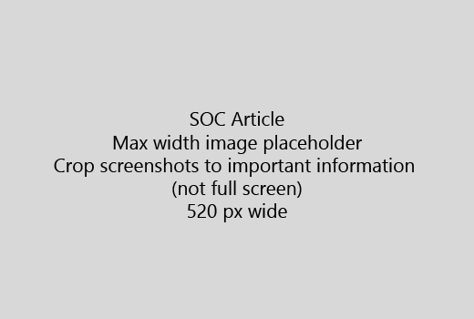

Začnite Váš článok veľmi stručný úvod (1 veta). Vžite sa do čitateľskej miesto - prečo sú tu? Čo by mali robiť?Start your article with a very short introduction (1 sentence). Put yourself in the reader's place - why are they here? What should they do? 
  
1. Zoberte rýchly zoznam krokov pre splnenie úlohy.Get straight to a quick list of steps to accomplish the task.
    
    Ak potrebujete vysvetliť pojem, alebo majú urobiť predpokladom kroky, pridať stručné zhrnutie nižšie krok, kde potrebujú, a [odkaz](https://support.office.com/article/f37e7984-cf03-4fde-92d3-82970d7e241b.aspx) na koncept alebo kroky.If you need to explain a concept, or they have to do pre-requisite steps, add a quick summary below the step where they need it, and [link](https://support.office.com/article/f37e7984-cf03-4fde-92d3-82970d7e241b.aspx) to the concept or steps. 
    
2. Majte postupy short - najlepšie 5 alebo menej krokov, nie viac ako 8.Keep procedures short - preferably 5 or fewer steps, no more than 8.
    
3. Použiť **štýl používateľského rozhrania** pre používateľské rozhranie prvky alebo text ľudia musieť zadať.Use **Ui style** for user interface elements or for text people need to enter. 
    
4. Použitie slovesami vybrať, vyberte, alebo zadať ako akcie a formátovanie menu ako **Menu** \> **príkaz**.Use the verbs choose, select, or enter as actions, and format menus as **Menu** \> **Command**.
    
5. Voliteľne pridať snímku pre kontext (ak UI je ťažké nájsť, alebo je potrebné na dokončenie úlohy).Optionally, add a screenshot for context (if UI is hard to locate, or it's needed to complete the task).
    
    Maximálna šírka: 520 pixelov. Použite štandardný motív, Zobraziť žiadne osobné informácie a nie orezať Ukázať, len čo je dôležité.Maximum width: 520 pixels. Use a standard theme, do not show any personal information, and crop to show only what's relevant. 
    
    
  
Ak chcete pridať video či snímku, použite dva stĺpce mriežky a krokov doľava a video alebo obrázok v pravom - pozri [kroky a príklad video mriežky](https://support.office.com/article/14ce8e82-efa0-47f5-bb84-94f078db3dae.aspx).If you want to add a video or screenshot, use a two-column grid and have the steps in the left and the video or screenshot in the right - see [Steps and video grid example](https://support.office.com/article/14ce8e82-efa0-47f5-bb84-94f078db3dae.aspx). 
  
Zacieliť na viac ako 500 slov za článok.Target no more than 500 words for an article.
  
# Napríklad článokExample article

[Zmeniť moju fotkuChange my photo](https://support.office.com/article/555376e0-1fca-49ba-8434-307a0525c767.aspx)
  

