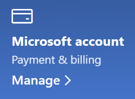

# Zmeniť moje informácie o konte Microsoft

Prejdite na [https://account.microsoft.com](https://account.microsoft.com/) a v prípade potreby sa prihláste Prejdete na svoju tabuľu konta.  

**Úprava môjho mena a osobných údajov**

1. Na tabuli konta vedľa profilového obrázka kliknite na možnosť **Viac akcií > Upraviť profil**.
2. Na stránke **Upraviť profil** použite poskytnuté prepojenia na zmenu profilového obrázka, mena, dátumu narodenia, polohy a zobrazenie jazykových preferencií. Všimnite si prepojenia na profily na Xboxe a Skype, kde môžete zmeniť podrobnosti týkajúce sa týchto účtov.

**Spravovanie e-mailových adries a telefónnych čísel**

Konto Microsoft má k sebe priradenú jednu alebo viac e-mailových adries alebo telefónnych čísel, ktoré sú jeho aliasmi. Ak ich chcete spravovať:

1. Na tabuli konta vedľa profilového obrázka kliknite na možnosť **Viac akcií > Upraviť profil**.
2. Na stránke **Upraviť profil** kliknite na možnosť **Spravovať spôsob prihlásenia do Microsoftu**. 
3. Uvidíte zoznam aliasov kont a môžete spravovať zoznam vrátane pridávania a vymazávania e-mailových adries a telefónnych čísel. Tu tiež môžete vybrať, ktoré aliasy sa môžu použiť na prihlásenie do konta a ktorý alias sa považuje za primárny a bude zobrazený na zariadeniach Windows 10.

**Sprava platobných metód a mena a adresy na fakturačné účely** 

1. Na tabuli konta vedľa profilového obrázka kliknite na možnosť **Viac akcií > Upraviť profil**.
2. V časti **Platby a fakturácia** kliknite na **Spravovať**.

    

3. Tu môžete pridávať, upravovať a odstraňovať platobné metódy a k nim priradené fakturačné adresy. 
