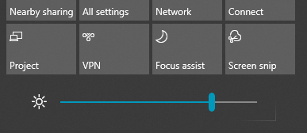

# Zmena jasu obrazovky vo Windowse 10

Ak je Windows 10 novšia ako verzia 1903, v centre akcií **sa** nachádza jazdec Jas. Ak chcete otvoriť Centrum  akcií, kliknite na tlačidlo Oznámenie na pravej strane panela úloh alebo na klávesnici **stlačte kombináciu klávesov Windows Home + A.**

Ak máte Windows 10 staršiu verziu, jazdec jasu nájdete v položke Nastavenie > **[Systém > obrazovke](ms-settings:display?activationSource=GetHelp)**.

**Poznámky:**

- Na stolných počítačoch s externým monitorom sa možno nezobrazuje jazdec zmeniť jas vstavaného zobrazenia. Ak chcete zmeniť jas externého monitora, použite ovládacie prvky na monitore.
- Ak nemáte stolný počítač a jazdec sa nezobrazuje alebo nefunguje, skúste aktualizovať ovládač obrazovky. Do vyhľadávacieho poľa na paneli úloh zadajte výraz **Správca zariadení** a potom v zozname **výsledkov** vyberte položku Správca zariadení. V **Správcovi zariadení** vyberte položku Display **adapters**(Zobrazovacie adaptéry) a potom vyberte zobrazovací adaptér. Stlačte a podržte zobrazovaný adaptér (alebo naň kliknite pravým tlačidlom myši) a kliknite na položku **Aktualizovať ovládač**. a postupujte podľa pokynov.
