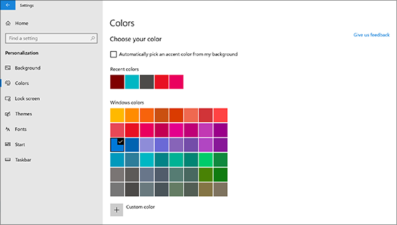
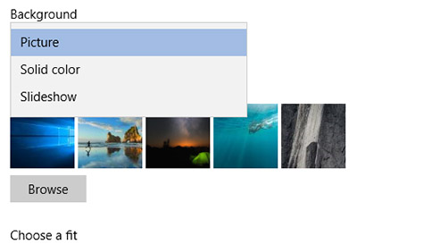

# Zmena pozadia a farieb pracovnej plochyChange your desktop background and colors

Ak chcete zmeniť nastavenie farieb, prejdite do ponuky **Štart** > -**Nastavenie** > **prispôsobovania** > **farieb**a potom vyberte vlastnú farbu alebo nechajte Windows vytiahnuť farbu motívu z pozadia.To change your colors setting, go to **Start** > **Settings** > **Personalization** > **Colors**, and then choose your own color or let Windows pull an accent color from your background.

Ak chcete zmeniť pozadie pracovnej plochy, prejdite do ponuky **Štart** > \*\*\*\* > \*\*\*\* > **–** prispôsobenie nastavení a potom vyberte obrázok, pevnú farbu alebo vytvorte prezentáciu obrázkov.To change your desktop background, go to **Start** > **Settings** > **Personalization** > **Background**, and then choose a picture, solid color, or create a slideshow of pictures. 

Chcete viac pozadia a farby pracovnej plochy?Want more desktop backgrounds and colors? Navštívte [Microsoft Store](https://www.microsoft.com/store/collections/windowsthemes) a vyberte si z desiatok voľných motívov.Visit [Microsoft Store](https://www.microsoft.com/store/collections/windowsthemes) to choose from dozens of free themes.
