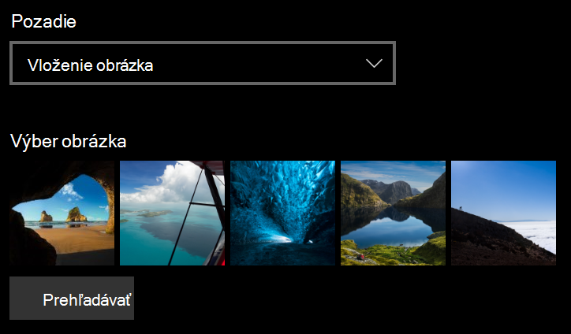
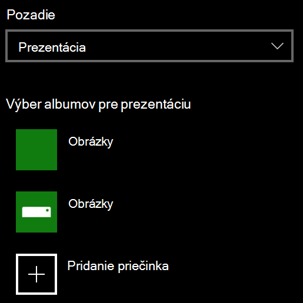

# Zmena pozadia obrazovky uzamknutia

- Prejdite na **Settings**  >  **Personalization**  >  **obrazovku uzamknutia**prispôsobenia nastavení. Alebo kliknite alebo ťuknite [sem](ms-settings:lockscreen?activationSource=GetHelp).

- Ak chcete nastaviť vlastný obrázok pozadia, vyberte položku **obrázok** z rozbaľovacieho zoznamu **pozadie** a vyberte alebo **vyhľadajte** obrázok.

  

- Ak chcete nastaviť prezentáciu vlastných obrázkov, v rozbaľovacom zozname **pozadia** vyberte položku **prezentácia** a vyberte album alebo pridajte priečinok obsahujúci obrázky prezentácie.

  
