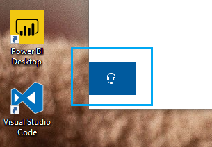

# Kontaktujte nás kliknutím na tlačidlo slúchadiel

Ak chcete kontaktovať podporu spoločnosti Microsoft, kliknite na položku **Kontaktujte nás** v ľavom dolnom rohu tejto aplikácie. V rámci letového okna sa po výbere produktu a kategórie problému zobrazí sprievodca správnym kanálom podpory.

So zvyškom aplikácie môžete naďalej komunikovať aj po tom, čo ste začali reláciu Kontaktujte nás. Panel Kontaktujte nás môžete dočasne minimalizovať kliknutím na ľubovoľné iné miesto v aplikácii. Ak sa chcete vrátiť do rovnakej relácie, stačí znova **kliknúť na položku Kontaktujte** nás.
