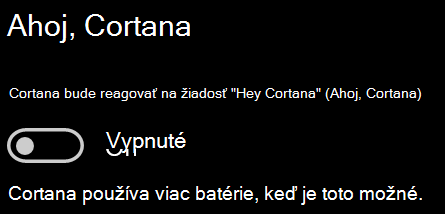

# Cortana so mnou nehovoríte alebo ma nepočujeCortana doesn’t talk to me or can’t hear me

Ak sa pokúšate použiť funkciu Ahoj, Cortana, ktorá vám umožňuje hovoriť s Cortanou bez výberu tlačidla Cortana na paneli úloh alebo tlačidla mikrofónu na paneli Cortany, skontrolujte, či je funkcia povolená:If you are trying to use the "Hey Cortana" feature, which allows you to talk to Cortana without selecting the Cortana button on the taskbar or the microphone button in the Cortana panel, confirm that the feature is enabled:

1. Prejdite do **ponuky Štart** a potom vyberte položky **[> Cortana](ms-settings:cortana?activationSource=GetHelp)**.Go to **Start**, then select **[Settings > Cortana](ms-settings:cortana?activationSource=GetHelp)**.
2. V **časti Hey Cortana (Ahoj, Cortana)** prepnite prepínač **Cortana reagovať na položku "Hey Cortana" (Ahoj, Cortana)** na možnosť **On (Zap.**)Under **Hey Cortana**, switch the **Let Cortana respond to "Hey Cortana"** toggle to **On**.

**Bráni vám Cortana v vypočutí nastavení ochrany osobných údajov?****Are your privacy settings preventing Cortana from hearing you?**

Nastavenia ochrany osobných údajov môžu zabrániť Cortane odpovedať na váš hlas.Your privacy settings can prevent Cortana from responding to your voice.
- Skontrolujte, či je zapnuté Online rozpoznávanie reči:Check to make sure Online Speech recognition is turned on:
    - Prejdite do **ponuky Štart** a potom kliknite na položky > Ochrana osobných > **[osobných údajov](ms-settings:privacy-speech?activationSource=GetHelp)**.Go to **Start**, then click **[Settings > Privacy > Speech](ms-settings:privacy-speech?activationSource=GetHelp)**.
    - V **časti Online rozpoznávanie** reči prepnite nastavenie na **Zapnúť**.Under **Online speech recognition**, switch the setting to **On**.
- Skontrolujte, či má Cortana povolenie na prístup k vášmu mikrofónu.Check to make sure Cortana has permission to access your microphone. 
    - Prejdite do ponuky Štart a potom kliknite **[na položky > Ochrana osobných > a mikrofón.](ms-settings:privacy-microphone?activationSource=GetHelp)**Go to Start, then click **[Settings > Privacy > Microphone](ms-settings:privacy-microphone?activationSource=GetHelp)**.
    - V **časti Vyberte aplikácie, ktoré**  majú prístup k vášmu mikrofónu vyhľadajte v zozname aplikácií a služieb Cortanu a skontrolujte, či je prepínač prepovaný do polohy **Zap.**Under **Choose which apps can access your microphone**, look for **Cortana** within the list of apps and services and make sure the switch is toggled to **On**.

Skontrolujte tiež, či sú reproduktory alebo mikrofóny správne fungujú, aby ste sa porozprával s Cortanou.Moreover, please also make sure that your speakers or microphones are up and working in order to talk to Cortana.
