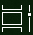

# Viac možností s multitaskingom vo Windowse 10Do more with multitasking in Windows 10

Zobrazenie alebo prepínanie medzi aplikáciami: môžete **kliknúť** na tlačidlo Zobrazenie úloh na paneli úloh alebo stlačiť **klávesy Alt-Tab** na klávesnici.To see or switch between apps: you can click the **Task View** button in the taskbar, or press **Alt-Tab** on your keyboard. Tlačidlo Zobrazenie úloh vyzerá takto:The Task View button looks like this:

Ak chcete jednoducho usporiadať dve aplikácie vedľa seba, pomocou asistenta prichytenia: uchopte hornú časť okna aplikácie a potiahnite ju na jednu stranu, aby ste ju prichytli do polovice obrazovky.To easily arrange two apps side by side, use Snap Assist: grab the top of an app window and drag it to one side to "snap" it to that half of the screen. Potom vyberte inú aplikáciu a automaticky sa prichytí na miesto v druhej polovici obrazovky.Then choose another app and it will automatically snap into place in the other half of the screen.

**Vytvorenie rôznych virtuálnych pracovných plôch pre domácnosť a prácu:****To create different virtual desktops for home and work**:

1. Kliknite na **tlačidlo Zobrazenie úloh** na paneli úloh alebo na **klávesnici stlačte kombináciu klávesov Alt** + Tab.Click the **Task View** button in the taskbar, or press **Alt-Tab** on your keyboard.
2. Kliknite **na položku + Nová pracovná** plocha (nachádza sa v ľavej hornej časti obrazovky v zobrazení úloh).Click **+ New Desktop** (located at the top left of your screen while in task view).
3. Otvorte aplikácie, ktoré chcete použiť.Open the apps you want to use. 

Ak chcete zobraziť **pracovné plochy a** prepínať medzi nimi, prejdite späť na zobrazenie úloh.Go back to **Task View** to see your desktops and switch between them.
