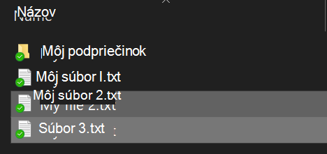
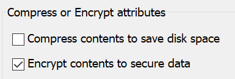

# Šifrovanie súborov alebo priečinkov vo Windowse 10

Šifrovanie BitLocker môžete zašifrovať celý disk, ale ak chcete šifrovať iba jednotlivé súbory alebo priečinky (a ich obsah):

1. V **Prieskumníkovi** vyberte súbory alebo priečinky, ktoré chcete šifrovať. V tomto príklade boli vybraté dva súbory:

    

2. Kliknite pravým tlačidlom myši na vybraté súbory a potom kliknite na položku **Vlastnosti.**

3. V okne **Vlastnosti** kliknite na položku **Rozšírené**.

4. V okne **Rozšírené vlastnosti** začiarknite políčko **Zašifrovať obsah na zabezpečenie** údajov:

    

5. Kliknite na tlačidlo **OK**.
