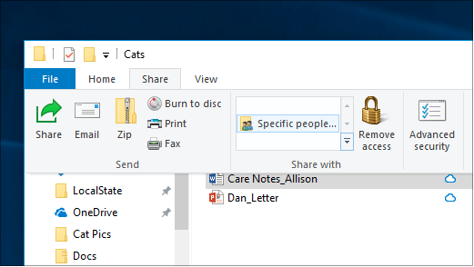
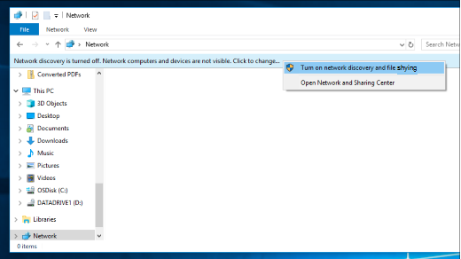

# Zdieľanie súborov prostredníctvom siete vo Windowse 10

**Poznámka:** Ak ste predtým používali domácu skupinu na zdieľanie súborov, upozorňujeme, že domáca skupina bola odstránená z Windowsu 10 (verzia 1803). Teraz môžete zdieľať tlačiarne a súbory pomocou vstavaných funkcií vo Windowse 10.

**Zdieľanie súborov alebo priečinkov prostredníctvom siete**

- V **Prieskumníkovi** vyberte súbor, > kliknite  na kartu Zdieľať v hornej  > časti Zdieľať s kliknite na položku **Konkrétne osoby**.

    
          
- Ak vyberiete viacero súborov naraz, môžete ich zdieľať všetky rovnakým spôsobom. Funguje aj v priečinkoch.

**Zobrazenie zariadení v sieti, ktoré zdieľajú súbory**

- V **Prieskumníkovi** prejdite na položku **Sieť**. Ak zisťovanie siete nie je povolené, zobrazí sa chybové hlásenie Zisťovanie siete je vypnuté...

- Kliknite na **banner Zisťovanie siete je vypnutý** a potom kliknite na položku Zapnúť **zisťovanie siete a zdieľanie súborov**.

    

[Ďalšie informácie o zdieľaní súborov cez sieť](https://support.microsoft.com/help/4092694/windows-10-file-sharing-over-a-network)

[Zdieľanie súborov pomocou aplikácií, OneDrivu, e-mailov a ďalších aplikácií](https://support.microsoft.com/help/4027674/windows-10-share-files-in-file-explorer)
