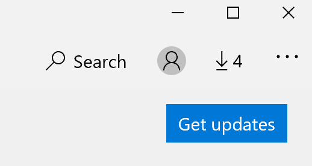

# Oprava jazyka zobrazenia aplikáciíFix the display language of apps

Po zmene jazyka zobrazenia vo Windowse 10 môžu niektoré aplikácie pri otváraní používať aj predchádzajúci jazyk.After you change the display language in Windows 10, some apps may still use the previous language when you open them. Stáva sa to preto, lebo nové verzie aplikácií pre daný jazyk je nutné stiahnuť z obchodu.This happens because new versions of the apps for that language must be downloaded from the Store. Ak chcete tento problém vyriešiť, môžete buď počkať na automatickú aktualizáciu, alebo môžete nainštalovať aktualizovanú verziu aplikácií manuálne.To fix this problem, you can either wait for the automatic update, or you can manually install the updated version of the apps.

Ak chcete aktualizáciu nainštalovať manuálne, otvorte **Microsoft Obchod** a kliknite na položku **stiahnuté a aktualizácie** v pravom hornom rohu.To manually install the update, open **Microsoft Store** and click **Downloads and updates** in the top right corner. Potom kliknite na položku **získať aktualizácie**.Then click **Get updates**. Ak sa po dokončení aktualizácie jazyk nezmení, skúste reštartovať počítač.If the language is not changed after the update is complete, try restarting your PC.

Ďalšie informácie o nastaveniach vstupného a zobrazovaného jazyka nájdete [v téme Správa vstupných a zobrazovaných nastavení jazyka vo Windowse 10](https://support.microsoft.com/help/4027670/windows-10-add-and-switch-input-and-display-language-preferences).To read more about input and display language settings, see [Manage your input and display language settings in Windows 10](https://support.microsoft.com/help/4027670/windows-10-add-and-switch-input-and-display-language-preferences).
