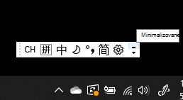
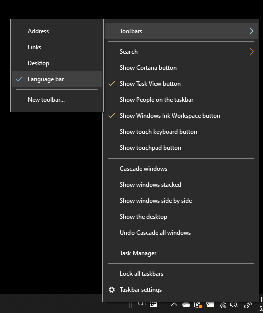
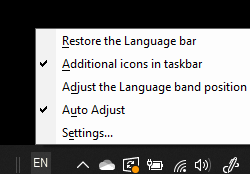

# Skrytie, zobrazenie alebo obnovenie panela jazykov

**Minimalizovanie panela jazykov:**

Môžete kliknúť na tlačidlo Minimalizovať v pravom hornom rohu panela jazykov. Prípadne môžete panel jazykov jednoducho presunúť na panel úloh, čím ho automaticky minimalizujete.

**Ak chcete zobraziť panel jazykov:**

Ak nechcete panel jazykov ukotviť na paneli úloh, kliknite pravým tlačidlom myši  na prázdne miesto na paneli úloh a zrušte začiarknutie možnosti Panel jazykov v ponuke Panely s nástrojmi. Panel jazykov sa zobrazí mimo panela úloh rovnako ako predchádzajúca snímka obrazovky.

**Ak chcete obnoviť predvolený panel jazykov:**

Kliknite pravým tlačidlom myši na tlačidlo jazyka na paneli s nástrojmi a potom v ponuke **kliknite na** položku Obnoviť možnosť panela jazykov. Týmto sa obnoví predvolené nastavenie.

