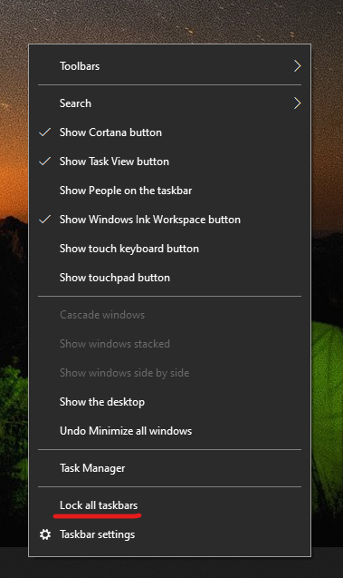

# Presunutie panela úloh na jednu stranu alebo do hornej časti pracovnej plochy

Najskôr potvrďte, že panel úloh je odomknutý. Ak chcete zistiť, či sú vaše poznámky odomknuté, kliknite  pravým tlačidlom myši na prázdne miesto na paneli úloh a skontrolujte, či sa vedľa položky Zamknúť panel úloh nachádza znak začiarknutia. Ak sa zobrazí znak začiarknutia, panel úloh je uzamknutý a nie je možné ho premiestniť. Kliknutím na **položku Zamknúť panel úloh** ho odomknete a odstránite znak začiarknutia.

Ak máte na paneli úloh zobrazených viacero monitorov, zobrazí sa časť **Uzamknutie všetkých panelov úloh**.

Po odomknutí panela úloh môžete stlačiť a podržať ľubovoľné prázdne miesto na paneli úloh a presunúť ho na želané miesto na obrazovke. Môžete to urobiť aj kliknutím pravým tlačidlom myši na prázdne miesto na paneli úloh a prechodom na nastavenia panela úloh ** > paneli úloh na obrazovke.**
