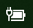
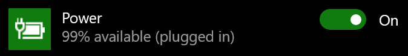

# Ikona napájania alebo batérie chýba vo Windowse 10Power or battery icon missing in Windows 10

Ak vaše zariadenie s Windowsom 10 obsahuje batériu (napríklad notebook alebo tablet alebo počítač pripojený cez USB k záložnému zdroju UPS), na paneli úloh v blízkosti hodín sa zvyčajne zobrazuje ikona napájania alebo batérie, napríklad:If your Windows 10 device has a battery (e.g., laptop or tablet, or a PC connected via USB to a UPS), normally a power/battery icon is shown in the taskbar near the clock, for example:

Ak sa táto ikona nezobrazuje, môže byť skrytá:If you don't see this icon, it may be hidden:

1. Prejdite na položky **[Nastavenia > Prispôsobenie > Panel úloh](ms-settings:taskbar?activationSource=GetHelp)**.Go to **[Settings > Personalization > Taskbar](ms-settings:taskbar?activationSource=GetHelp)**.

2. V časti Oblasť oznámení kliknite na položku **Vyberte ikony, ktoré sa budú zobrazovať na paneli úloh**.In the Notification area, click **Select which icons appear on the taskbar**.

3. Potom v zozname vyhľadajte položku **Napájanie** a prepnite jej nastavenie na možnosť **Zapnuté**.Then find the **Power** item in the list and toggle its setting to **On**.

    

**Riešenie problémov****Troubleshooting**

Ak ste postupovali podľa uvedených pokynov a prepínač **Napájanie** je sivý alebo sa nezobrazuje, do vyhľadávacieho poľa na paneli úloh napíšte výraz **správca zariadení** a potom v zozname výsledkov vyberte položku **Správca zariadení**.If you followed the above instructions and the **Power** toggle is greyed out or not visible, in the search box on the taskbar, type **device manager**, and then select **Device Manager** in the list of results. V časti **Batérie** kliknite pravým tlačidlom myši na batériu zariadenia, kliknite na položku **Zakázať** a potom na položku **Áno**.Under **Batteries**, right-click the battery for your device, click **Disable**, and click **Yes**. Počkajte niekoľko sekúnd, kliknite pravým tlačidlom myši na batériu a kliknite na položku **Povoliť**.Wait a few seconds, and then right-click the battery and click **Enable**. Potom reštartujte zariadenie.Then restart your device.

Ak ste postupovali podľa uvedených pokynov, ale ikona batérie sa na paneli úloh nezobrazuje, do vyhľadávacieho poľa na paneli úloh napíšte výraz **správca úloh** a potom v zozname výsledkov kliknite na položku **Správca úloh**.If you followed the above instructions, but the battery icon does not appear on the taskbar, in the search box on the taskbar, type **task manager**, and then click **Task Manager** in the list of results. Na karte **Procesy** v stĺpci časti **Názov** kliknite pravým tlačidlom myši na položku **Prieskumník** a potom kliknite na položku **Reštartovať**.On the **Processes** tab, under **Name**, right-click **Explorer**, and then click **Restart**.
