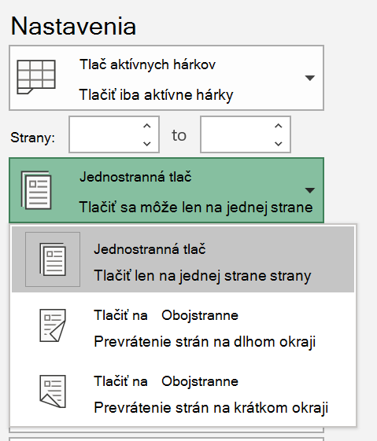
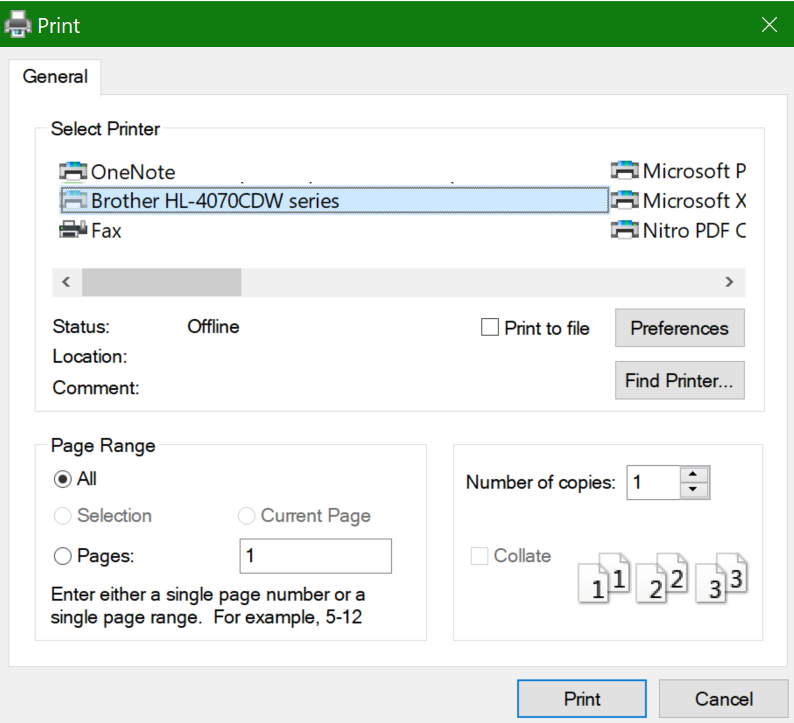

# Tlač na obidve strany papiera (obojstranná tlač)

**Je moja tlačiareň schopná obojstrannej tlače?**

Súhrnné alebo manuálne funkcie vašej tlačiarne by vám mali povedať, či je možné tlačiť na obidve strany papiera, známej aj ako "Obojstranná tlač". Ak máte balík Microsoft Office, ďalším spôsobom, ako zistiť, je otvorením aplikácie balíka Office, ako je Word alebo Excel, chystá sa **súbor > tlač**, uistite sa, že je vybratá správna tlačiareň, a hľadať možnosti v sekcii nastavenia. Príklad: 

**Obojstranná tlač v balíku Microsoft Office**

Ak je tlačiareň schopná tlačiť na obidve strany, keď prejdete do **súboru > vytlačiť** v aplikácii balíka Office, uvidíte možnosť "tlač na oboch stranách", ako je znázornené vyššie.  Vyberte typ obojstrannej tlače, ktorú chcete (Flip na dlhé okraje, alebo Flip na krátku hranu), a kliknite na tlačidlo **tlač** Ak chcete spustiť výtlačok.

**Obojstranná tlač z ľubovoľnej aplikácie**

V mnohých aplikáciách pri tlači sa zobrazí všeobecné tlačové dialógové okno, ktoré vyzerá takto: 

Presvedčte sa, či je vybratá správna tlačiareň, a potom kliknutím na položku **predvoľby** otvorte okno Predvoľby tlačiarne. Ak je tlačiareň schopná obojstrannej tlače, v tomto okne sa zobrazí možnosť povoliť túto aktuálnu tlačovú úlohu.
