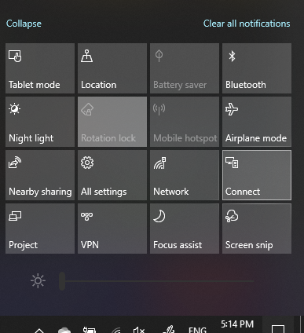

# Project k POČÍTAČU

V cieľovom zariadení (premieta sa do) vyhľadajte položku Projekcia Nastavenia. Otvorí sa stránka Nastavenia **projectingu na tomto počítači.** Potom skontrolujte, či:
- Niektoré Windows zariadenia s Androidom môžu v tomto počítači premietať, keď poviete, že je to v poriadku, je nastavená na **možnosť Vždy vypnuté.**
- Rozbaľovacia ponuka Požiadať o projekt na tomto počítači je nastavená na **možnosť Vždy, keď sa vyžaduje pripojenie.**
- Rozbaľovacia ponuka Vyžadovať PIN kód na párovanie je nastavená na možnosť **Nikdy**.

V cieľovom zariadení spustite **Pripojenie** tak, že v ponuke **Štart** vyhľadáte slovné Pripojenie.

Potom v zdrojovom zariadení, z ktorých sa pokúšate premietať:

1. Stlačením **Windows + A** otvorte Centrum akcií.
2. Kliknite na **Pripojenie**.
3. Kliknite na zariadenie, na ktoré chcete premietať obrazovku.

Po krokoch uvedených vyššie by sa v cieľovom zariadení mala zobrazovať obrazovka zdrojového zariadenia, ako keby ide o sekundárny monitor.
