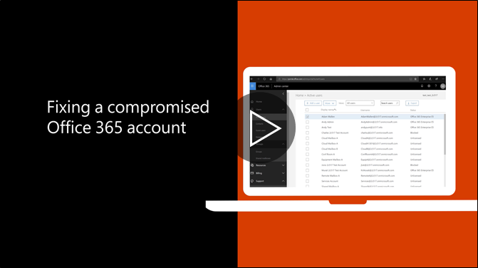

# Odporúčaný postup Ak účet je ohrozenáRecommended steps to take if an account is compromised

  
1. [Obnoviť heslo](https://support.office.com/article/7a5d073b-7fae-4aa5-8f96-9ecd041aba9c) okamžite. Nové heslo prostredníctvom e-mailu nekomunikuje koncovému používateľovi.[Reset the user's password](https://support.office.com/article/7a5d073b-7fae-4aa5-8f96-9ecd041aba9c) immediately. Do not communicate the new password through email to the end user. 
    
2. Odstráňte akékoľvek podozrivé [presmerovanie adresy](https://support.office.com/article/ab5eb117-0f22-4fa7-a662-3a6bdb0add74) na úrovni poštovej schránky.Remove any suspicious [forwarding addresses](https://support.office.com/article/ab5eb117-0f22-4fa7-a662-3a6bdb0add74) set at the mailbox level. 
    
3. Odstráňte všetky podozrivé [pravidlá pre doručenú poštu](https://support.office.com/article/1433E3A0-7FB0-4999-B536-50E05CB67FED) v poštovej schránke.Remove any suspicious [inbox rules](https://support.office.com/article/1433E3A0-7FB0-4999-B536-50E05CB67FED) set within the mailbox. 
    
4. Ak používateľ je blokovaný od odoslania e-mailu, [prejdite na obmedzených užívateľom odblokovať konto](https://protection.office.com/?hash=/restrictedusers). Akonáhle budete hotoví, používateľ by mali byť schopní pokračovať v odosielaní správ za 1 hodinu.If the user is blocked from sending email, [go to the Restricted Users to unblock the account](https://protection.office.com/?hash=/restrictedusers). Once done, the user should be able to resume sending messages within 1 hour.
    
5. Odstrániť používateľské konto z akékoľvek [administratívne úlohy skupiny](https://support.office.com/article/eac4d046-1afd-4f1a-85fc-8219c79e1504) , kým ste si istí, že účet je už ohrozená.Remove the user account from any [administrative role groups](https://support.office.com/article/eac4d046-1afd-4f1a-85fc-8219c79e1504) until you are confident that the account is no longer compromised. 
    
Aby sa minimalizovalo riziko porušenia ochrany údajov alebo neoprávnený prístup k účtu v budúcnosti, odporúčame prečítať naše [Office 365 zabezpečenia najlepších postupov článku](https://support.office.com/article/9295e396-e53d-49b9-ae9b-0b5828cdedc3).To minimize the potential of a data breach or a compromised account in the future, we recommend reading our [Office 365 Security best practices article](https://support.office.com/article/9295e396-e53d-49b9-ae9b-0b5828cdedc3).
  

