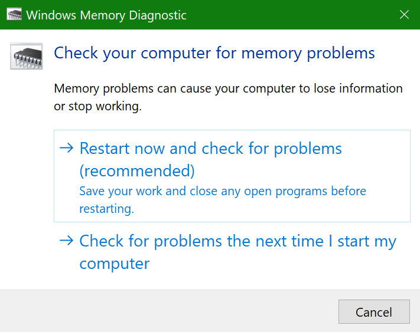
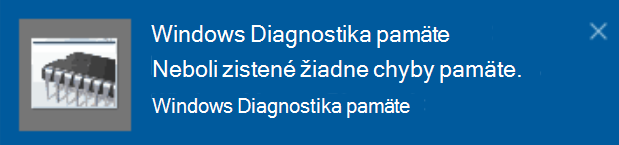

# Spustenie diagnostiky pamäte Windowsu vo Windowse 10Run Windows Memory Diagnostics in Windows 10

Ak Windows a aplikácie v počítači zlyhávajú, zamŕzajú alebo pôsobia nestabilným spôsobom, môže ísť o problém s pamäťou PC (RAM).If Windows and apps on your PC are crashing, freezing, or acting in an unstable manner, you may have a problem with the PC’s memory (RAM). Môžete spustiť nástroj Diagnostika pamäte Windowsu a zistiť, či sa v počítači nenálili problémy s pamäťou RAM počítača.You can run the Windows Memory Diagnostic to check for problems with the PC’s RAM.

Do vyhľadávacieho poľa na paneli úloh zadajte výraz **Diagnostika pamäte** a potom vyberte položku **Diagnostika pamäte systému Windows.**In the search box on your taskbar, type **memory diagnostic**, and then select **Windows Memory Diagnostic**. 

Na spustenie diagnostiky musí byť počítač reštartovaný.To run the diagnostic, the PC needs to restart. Máte možnosť okamžite reštartovať (najprv uložte svoju prácu a zatvorte otvorené dokumenty a e-maily) alebo naplánujte spustenie diagnostiky automaticky pri ďalšom reštartovaní počítača:You have the option to restart immediately (please save your work and close open documents and e-mails first), or schedule the diagnostic to run automatically the next time the PC restarts:

Po reštartovaní počítača sa **nástroj Windows Diagnostika pamäte** spustí automaticky.When the PC restarts, the **Windows Memory Diagnostics Tool** will run automatically. Stav a priebeh sa budú zobrazovať pri spustení diagnostiky a máte možnosť zrušiť diagnostiku stlačením klávesu **ESC** na klávesnici.Status and progress will be displayed as the diagnostics run, and you have the option of cancelling the diagnostics by hitting the **ESC** key on your keyboard.

Po dokončení diagnostiky sa Windows spustí normálne.When the diagnostics are complete, Windows will start normally.
Po reštartovaní sa hneď po reštartovaní zobrazí oznámenie  (vedľa ikony Centrum akcií na paneli úloh), ktoré informuje, či sa našli nejaké chyby pamäte.Immediately after restart, when the Desktop appears, a notification will appear (next to the **Action Center** icon on the taskbar), to indicate whether any memory errors were found. Príklad:For example:

Tu je ikona Centra akcií:Here's the Action Center icon:  

A vzorové oznámenie:And a sample notification: 

Ak ste oznámenie nestihli,  môžete vybrať ikonu Centra  akcií na paneli úloh a zobraziť centrum akcií a zobraziť posúvateľný zoznam oznámení.If you missed the notification, you can select the **Action Center** icon  on the taskbar to display the **Action Center** and see a scrollable list of notifications.

Ak chcete skontrolovať podrobné informácie, **do** vyhľadávacieho poľa na paneli úloh zadajte udalosť a potom vyberte položku **Zobrazovač udalostí**.To review detailed information, type **event** into the search box on your taskbar, and then select **Event Viewer**. Na **ľavej table** zobrazovača udalostí prejdite na položku **Denníky Windowsu > systému**.In the **Event Viewer**’s left-hand pane, navigate to **Windows Logs > System**. Na pravej table si pri pohľade na  stĺpec Zdroj pozrite zoznam nadol, až kým sa nenájde udalosť s hodnotou Source value **MemoryDiagnostics-Results.**In the right-hand pane, scan down the list while looking at the **Source** column, until you see events with Source value **MemoryDiagnostics-Results**. Zvýraznite každú takúto udalosť a v poli na karte Všeobecné pod **zoznamom** zobrazte informácie o výsledku.Highlight each such event and see the result information in the box under the **General** tab below the list.
