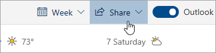

# Zdieľanie s Outlookom na webeSharing with Outlook on the web

V kalendári na paneli s nástrojmi v hornej časti stránky vyberte položku **Zdieľať**a vyberte kalendár, ktorý chcete zdieľať.From your Calendar, on the toolbar at the top of the page, select **Share**, and choose the calendar you want to share.

    

**Poznámka:** Kalendáre vo vlastníctve iných ľudí nie je možné zdieľať.**Note**: You can't share calendars owned by other people.

- Zadajte meno alebo e-mailovú adresu osoby, s ktorou chcete kalendár zdieľať.Enter the name or email address of the person you want to share your calendar with.
- Vyberte spôsob, akým má daná osoba používať váš kalendár:Choose how you want the person to use your calendar:
    - **Zobrazenie môžete zobraziť, keď som zaneprázdnený**   Umožňuje im zistiť, kedy ste zaneprázdnení, ale neobsahuje podrobnosti, ako je umiestnenie udalosti.**Can view when I'm busy** lets them see when you're busy but doesn't include details like the event location.
    - **Môže zobraziť názvy a miesta**   umožňuje im vidieť, kedy ste zaneprázdnení, rovnako ako názov a umiestnenie udalostí.**Can view titles and locations** lets them see when you're busy, as well as the title and location of events.
    - **Môžete zobraziť všetky podrobnosti**   umožňuje im zobraziť všetky podrobnosti o vašich udalostiach.**Can view all details** lets them see all the details of your events.
    - **Môžete upraviť**   umožňuje im upravovať kalendár.**Can edit** lets them edit your calendar.
    - **Delegovať**   umožňuje im upravovať kalendár a zdieľať ho s ostatnými.**Delegate** lets them edit your calendar and share it with others.
- Vyberte polo **ku Zíotods»**.Select **Share**.
