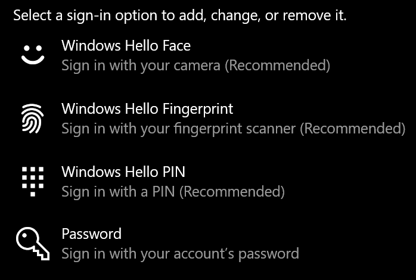
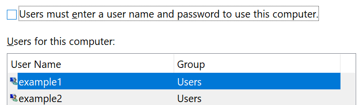

# Prihlásenie do Windowsu 10 bez použitia heslaSign-in to Windows 10 without using a password

Ak sa chcete vyhnúť zadávaniu hesla pri spustení systému Windows, odporúčame vám, aby ste v prípade dostupnosti, ako je napríklad PIN kód, rozpoznanie tváre alebo odtlačok prsta, použili niektoré z možností prihlásenia Windows Hello.To avoid having to type a password at Windows startup, we recommend you use one of the Windows Hello secure sign-in options, like a PIN, face recognition, or fingerprint, if available. Ak naozaj chcete zakázať prihlasovanie, pozrite si nižšie uvedené pokyny "automaticky sa prihláste do Windowsu 10".If you really want to disable secure sign-in, see the "Automatically sign in to Windows 10" instructions below.

**Možnosti zabezpečenia Windows Hello na heslo konta****Secure Windows Hello alternatives to the account password**

Prejdite na **položky nastavenia > kontá > možnosti prihlásenia** (alebo kliknite [sem](ms-settings:signinoptions?activationSource=GetHelp)).Go to **Settings  > Accounts > Sign-in options** (or click [here](ms-settings:signinoptions?activationSource=GetHelp)). Zobrazia sa dostupné možnosti prihlásenia.Available sign-in options will be listed. Príklad:For example:

Kliknite alebo ťuknite na niektorú z možností, ktorú chcete konfigurovať.Click or tap one of the options to configure it. Pri ďalšom spustení alebo odomknutí okien budete môcť namiesto hesla použiť novú možnosť.Next time you start or unlock Windows, you will be able to use the new option instead of a password. 

**Automatické prihlásenie do Windowsu 10****Automatically sign-in to Windows 10**

**Poznámka**: automatické prihlásenie je pohodlné, ale predstavuje riziko zabezpečenia, najmä ak je váš počítač dostupný viacerými ľuďmi.**Note**: Automatic sign-in is convenient, but introduces a security risk, especially if your PC is accessible by multiple people. 

1. Kliknite alebo ťuknite na tlačidlo **Štart** na paneli úloh.Click or tap the **Start** button in the Taskbar.

2. Ak chcete otvoriť okno Používateľské kontá, zadajte **do hodnotu netplwiz** a stlačte kláves ENTER.Type **netplwiz** and hit the Enter key to open the User Accounts window.

3. V časti **používateľské kontá**kliknite na konto, na ktoré sa chcete automaticky prihlásiť pri spustení systému Windows.In **User Accounts**, click the account you want to automatically sign in to when Windows starts.

4. Zrušiť začiarknutie políčka používatelia musia zadať meno používateľa a heslo na používanie tohto počítača.Uncheck the "Users must enter a user name and password to use this computer" checkbox.

    

5. Kliknite na tlačidlo **OK**.Click **OK**. Zobrazí sa výzva na zadanie a potvrdenie hesla konta, ktoré ste vybrali.You will be asked to enter and confirm the password for the account you selected. Kliknutím na **tlačidlo OK** dokončite dokončenie.Click **OK** to finish. Pri ďalšom spustení Windowsu 10 sa automaticky prihlásite do vybratého konta.Next time Windows 10 starts, it will automatically sign in to the account you selected.
