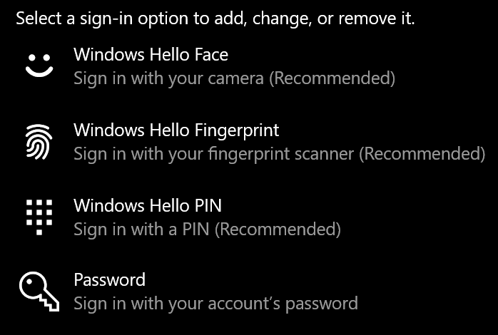

# Použitie možnosti odomknutia prsta vo Windowse 10Use fingerprint unlock option in Windows 10

**Zapnutie odtlačku prsta vo Windows Hello****Enable Windows Hello Fingerprint**

Ak chcete Windows 10 odomknúť pomocou odtlačku prsta, je potrebné nastaviť odtlačok prsta Windows Hello pridaním aspoň jedného prsta (ktorý Windows rozpozná, aby ho rozpoznal).To unlock Windows 10 using your fingerprint, you need to set up Windows Hello Fingerprint by adding (letting Windows learn to recognize) at least one finger. 

1. Prejdite na **položky > Kontá > Možnosti prihlásenia** (alebo kliknite [sem](ms-settings:signinoptions?activationSource=GetHelp)).Go to **Settings  > Accounts > Sign-in options** (or click [here](ms-settings:signinoptions?activationSource=GetHelp)). Zobrazí sa zoznam dostupných možností prihlásenia.Available sign-in options will be listed. Príklad:For example:

    

2. Kliknite alebo ťuknite na **položku Odtlačok prsta vo Windows Hello** a potom kliknite na položku **Nastaviť**.Click or tap **Windows Hello Fingerprint**, then click **Set up**. V okne nastavenia funkcie Windows Hello kliknite na **položku Začíname.**In the Windows Hello setup window, click **Get started**. Aktivuje sa senzor odtlačku prsta a zobrazí sa výzva, aby ste na senzor umiestnili prst:The fingerprint sensor will activate, and you'll be asked to place your finger on the sensor:

   

3. Postupujte podľa pokynov, ktoré vás požiadajú, aby ste opakovane skenovali prst.Follow the instructions, which will ask you to repeatedly scan your finger. Po dokončení tejto úlohy budete mať možnosť pridať ďalšie prsty, ktoré možno budete chcieť použiť na prihlásenie.When this is finished, you'll have the option of adding other fingers you may want to use for sign-in. Keď sa nabudúce prihlásite do Windowsu 10, budete mať možnosť použiť na to odtlačky prsta.Next time you sign in to Windows 10, you will have the option of using your fingerprint to do so.

**Odtlačok prsta vo Windows Hello nie je k dispozícii ako možnosť prihlásenia****Windows Hello Fingerprint not available as a sign-in option**

Ak sa odtlačky prsta vo Windows Hello nezobrazuje ako možnosť v možnostiach **prihlásenia,** znamená to, že Windows nevie o žiadnom čítačke odtlačkov prsta alebo skeneri pripojenom k PC alebo že systémová politika bráni jeho pracovisku (ak napríklad počítač spravuje vaše pracovisko).If Windows Hello Fingerprint is not shown as an option in **Sign-in options**, it means Windows is not aware of any fingerprint reader/scanner attached to your PC, or that a system policy prevents its use (if for example your PC is managed by your workplace). Riešenie problémov:To troubleshoot: 

1. Na paneli **úloh** vyberte tlačidlo Štart a vyhľadajte položku **Správca zariadení**.Select the **Start** button in the Taskbar and search for **Device Manager**.

2. Kliknutím alebo ťuknutím otvorte Správcu **zariadení**.Click or tap to open **Device Manager**.

3. V Správcovi zariadení rozbaľte položku Biometrické zariadenia kliknutím na jej výložku.In Device Manager, expand Biometric devices by clicking its chevron.

   

4. Váš skener odtlačkov prsta by mal byť uvedený ako biometrické zariadenie, ako je napríklad Skener WBDI, a tento skener:Your fingerprint scanner should be listed as a biometric device, such as the Synaptics WBDI scanner:

   

5. Ak sa skener odtlačkov prstov nezobrazuje a skener je integrovaný do počítača, prejdite na webovú lokalitu výrobcu počítača.If your fingerprint scanner is not shown, and the scanner is integrated into your PC, go to the PC manufacturer's website. V časti technickej podpory pre model vášho PC vyhľadajte ovládač pre Windows 10, ktorý môžete nainštalovať.In the technical support section for your PC model, search for a Windows 10 driver for a scanner that you can install.

6. Ak je skener oddelený od PC (pripojeného cez USB), prejdite na webovú lokalitu výrobcu skenera a vyhľadajte a nainštalujte softvér ovládača zariadenia s Windowsom 10 pre model skenera, ktorý máte.If the scanner is separate from the PC (attached via USB), go to the scanner manufacturer's website to find and install Windows 10 device driver software for the scanner model you have.
