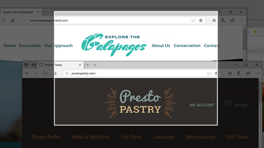
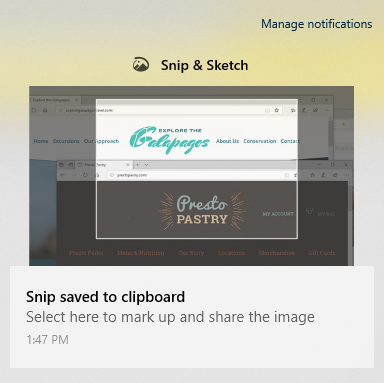

# Zachytávanie, označovanie a zdieľanie obrázkov pomocou &nia výstrižkov

Skica obrazovky sa teraz nazýva **výstrižok & skica**. Rýchle odobratie **výstrižku**:

1. Stlačte kláves s **logom Windows + Shift + S**. Zobrazí sa obrazovka stmavnutie a kurzor sa zobrazí ako krížik. 

2. Vyberte bod na okraji oblasti, ktorú chcete kopírovať, a potom kliknite ľavým tlačidlom myši na kurzor. 

3. Posunutím kurzora zvýraznite oblasť, ktorú chcete zachytiť. Oblasť, ktorú zaznamenávate, sa zobrazí na obrazovke.

   

Obrázok, ktorý použitých, je uložený v schránke, ktorý je pripravený na prilepenie do e-mailu alebo dokumentu. 

**Ak chcete upraviť alebo Zobraziť obrázok**: 

- Kliknite na ikonu oznámenia na pravej strane panela úloh. potom kliknite na obrázok, ktorý ste práve zachytili. Výstrižok sa otvorí v aplikácii výstrižok & skica.

   
