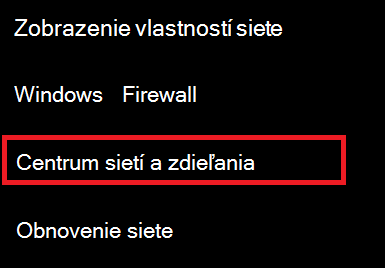
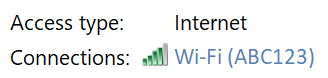
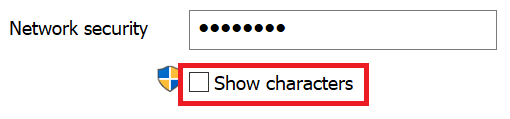

# Zobrazenie Wi-Fi sieťového hesla Windows 10

1. Skontrolujte, či Windows 10 počítač pripojený k počítačovej Wi-Fi siete.

2. Prejdite na **Nastavenia > Stav siete & internet > alebo** kliknutím alebo  ťuknutím sem dovoľte, aby sme vás tam teraz vzali.)

3. Kliknite na **položku Centrum sietí a zdieľania.**

    

4. V **Centre sietí a** zdieľania vedľa **položky** Pripojenia sa zobrazí názov vašej bezdrôtovej siete. Ak má napríklad vaša sieť názov ABC123, môže sa zobraziť:

    

    Kliknutím na názov bezdrôtovej siete otvorte okno Wi-Fi stav siete. 

5. V okne Wi-Fi Vlastnosti bezdrôtovej **komunikácie** kliknite na kartu **Zabezpečenie** a začiarknite políčko **Zobraziť znaky**.

    

