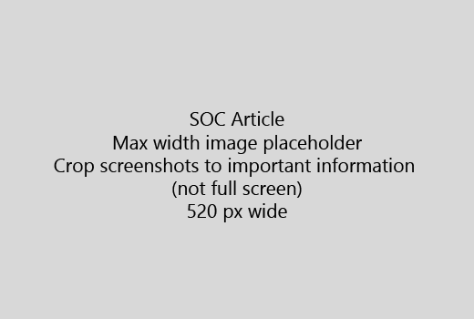

Začnite Váš článok veľmi stručný úvod (1 veta). Vžite sa do čitateľskej miesto - prečo sú tu? Čo by mali robiť? 
  
1. Zoberte rýchly zoznam krokov pre splnenie úlohy.
    
    Ak potrebujete vysvetliť pojem, alebo majú urobiť predpokladom kroky, pridať stručné zhrnutie nižšie krok, kde potrebujú, a [odkaz](https://support.office.com/article/f37e7984-cf03-4fde-92d3-82970d7e241b.aspx) na koncept alebo kroky. 
    
2. Majte postupy short - najlepšie 5 alebo menej krokov, nie viac ako 8.
    
3. Použiť **štýl používateľského rozhrania** pre používateľské rozhranie prvky alebo text ľudia musieť zadať. 
    
4. Použitie slovesami vybrať, vyberte, alebo zadať ako akcie a formátovanie menu ako **Menu** \> **príkaz**.
    
5. Voliteľne pridať snímku pre kontext (ak UI je ťažké nájsť, alebo je potrebné na dokončenie úlohy).
    
    Maximálna šírka: 520 pixelov. Použite štandardný motív, Zobraziť žiadne osobné informácie a nie orezať Ukázať, len čo je dôležité. 
    
    
  
Ak chcete pridať video či snímku, použite dva stĺpce mriežky a krokov doľava a video alebo obrázok v pravom - pozri [kroky a príklad video mriežky](https://support.office.com/article/14ce8e82-efa0-47f5-bb84-94f078db3dae.aspx). 
  
Zacieliť na viac ako 500 slov za článok.
  
# Napríklad článok

[Zmeniť moju fotku](https://support.office.com/article/555376e0-1fca-49ba-8434-307a0525c767.aspx)
  

